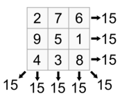

# SI, TGR 1

## Ejercicio 1, Puzzle 3x3

El 8-puzzle consiste en un tablero de 3x3 con ocho fichas numeradas y un espacio en blanco. Una ficha adyacente al espacio en blanco puede deslizarse a éste. La meta es alcanzar el estado objetivo especificado tal como se muestra en la figura de la derecha en el menor número de movimientos posible.  

- **Estado inicial**: Cualquiera con una matriz con valores del 0 al 8 sin repeticiones, donde el 0 es el hueco
- **Conjunto de acciones**

| Acción          | Precondiciones                     |
| --------------- | ---------------------------------- |
| Mover arriba    | Debe estar el hueco arriba         |
| Mover abajo     | Debe estar el hueco abajo          |
| Mover izquierda | Debe estar el hueco a la izquierda |
| Mover derecha   | Debe estar el hueco a la derecha   |

- **Modelo de transiciones**

| Acción          | Precondicion                       | Resultado                         |
| --------------- | ---------------------------------- | --------------------------------- |
| Mover arriba    | Debe estar el hueco arriba         | Intercambiar casilla con el hueco |
| Mover abajo     | Debe estar el hueco abajo          | Intercambiar casilla con el hueco |
| Mover izquierda | Debe estar el hueco a la izquierda | Intercambiar casilla con el hueco |
| Mover derecha   | Debe estar el hueco a la derecha   | Intercambiar casilla con el hueco |

- **Prueba de meta**: El array está ordenado de izquierda a derecha y de arriba a abajo.
- **Función coste de camino**: Sumar número de movimientos desde el estado inicial hasta llegar al final.

## Ejercicio 2, Viaje de Arad a Bucarest

Mapa de Rumanía simplificado, que incluye los costes de los tramos individuales. El objetivo es ir desde Arad a Bucarest. Podemos suponer que el mapa viene representado como una serie de tuplas (ciudad origen, ciudad destino, km) que representan las carreteras (ejemplo: (Arad, Sibiu, 140)).  

- **Estado inicial**: Un nodo de origen, uno de destino y un grafo con peso conexo al que pertenecen. 
- **Conjunto de acciones**:

| Acción            | Precondición     |
| ----------------- | ---------------- |
| Moverse a un nodo | Nodo no visitado |

- **Modelo de transiciones**

| Acción            | Precondición     | Resultado                                                    |
| ----------------- | ---------------- | ------------------------------------------------------------ |
| Moverse a un nodo | Nodo no visitado | (nodoOrigen, nodoDestino, peso + pesoAcumulado) nodoOrigen = nodoDestino nodoDestino = nuevoNodoDestino |

- **Prueba de meta**: Comprobar que nodoDestino sea el nodo deseado.
- **Función coste de camino**: Retornar pesoAcumulado

## Ejercicio 3, Cuadrado mágico $$N \times N$$

Un cuadrado mágico de $$N \times N$$ es una matriz que contiene los números entre 1 y N^2^ dispuestos de tal manera que la suma de los elementos de cada una de sus filas (o de sus columnas o de sus diagonales principales) es siempre la misma: $$\frac{N(N^2 + 1)}{2}$$

- **Estado inicial**: Matriz NxN vacía
- **Conjunto de acciones**: 

| Acción          | Precondición                                                 |
| --------------- | ------------------------------------------------------------ |
| Insertar número | Número no repetido Casilla vacía Suma de fila, columna <= $$\frac{N(N^2 + 1)}{2}$$  Si está en diagonal, la suma <= $$\frac{N(N^2 + 1)}{2}$$ |
| Borrar número   | Halla casillas vacías y no se puedan insertar más números    |

- **Modelo de transiciones**:

| Acción          | Precondición                                                 | Resultado                                                  |
| --------------- | ------------------------------------------------------------ | ---------------------------------------------------------- |
| Insertar número | Número no repetido Casilla vacía Suma de fila y  columna <= $$\frac{N(N^2 + 1)}{2}$$  Si está en diagonal, la suma <= $$\frac{N(N^2 + 1)}{2}$$ | cuadrado[x]\[y] = nuevoNumero                              |
| Borrar número   | Halla casillas vacías y no se puedan insertar más números    | cuadrado[x]\[y] = 0 Descartar número para esa casilla |

- **Prueba de meta**: Suma de todas las filas, columnas y diagonales debe ser igual a $$\frac{N(N^2 + 1)}{2}$$
- **Función coste de camino**: Número de casillas insertadas o eliminadas en total.

## Ejercicio 4, Sudoku

El sudoku es un pasatiempo cuyo objetivo es rellenar una cuadrícula de 9x9 celdas dividida en subcuadrículas de 3x3 con las cifras del 1 al 9 partiendo de algunos números ya dispuestos en algunas de las celdas. No se debe repetir ningún número en una misma fila, columna o subcuadrícula. 

- **Estado inicial**: Matriz 9x9 con algunas casillas ya rellenas
- **Conjunto de movimientos**

| Acción          | Precondición                                                 |
| --------------- | ------------------------------------------------------------ |
| Insertar número | Número no repetido en fila, columna o subcuadrante Casilla vacía |
| Borrar número   | Halla casillas y no se puedan insertar más números           |

- **Modelo de transiciones**

| Acción          | Precondición                                                 | Resultado                                                  |
| --------------- | ------------------------------------------------------------ | ---------------------------------------------------------- |
| Insertar número | Número no repetido en fila, columna o subcuadrante Casilla vacía | cuadrado[x]\[y] = nuevoNumero                              |
| Borrar número   | Halla casillas vacías y no se puedan insertar más números    | cuadrado[x]\[y] = 0 Descartar número para esa casilla |

- **Prueba de meta**: Matriz con filas, columnas y subcuadrantes con números del 1 al 9
- **Función coste de camino**: Número de casillas insertadas y borradas en total